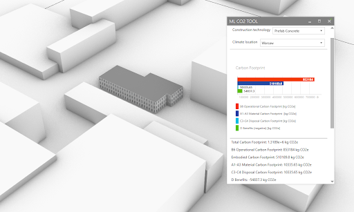
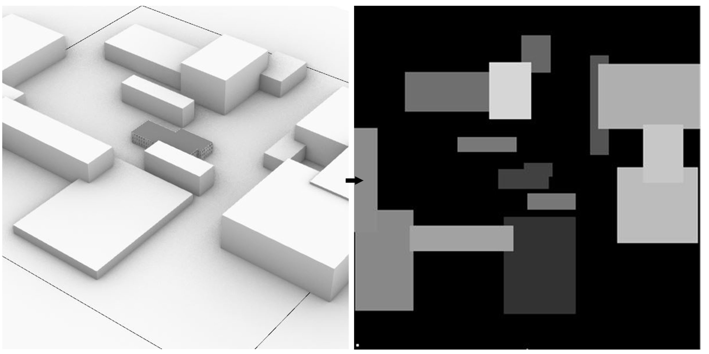
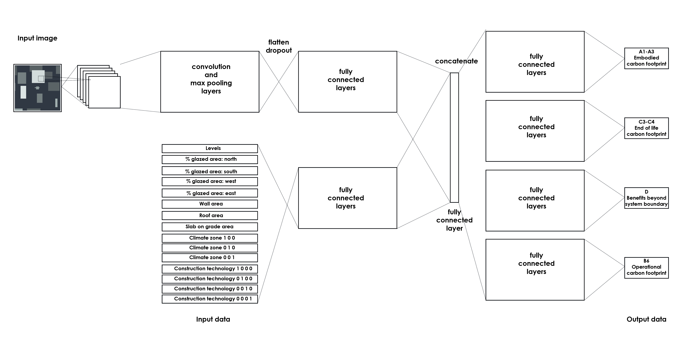

# PhD project - Predicting Carbon Footprint Of Buildings - MLCO2 tool for architects
This repository contains all the programming work carried out to create the MLCO2 tool.
The full PhD can be read in polish here: https://www.researchgate.net/publication/360519981_Cyfrowe_metody_wspomagania_projektowania_architektonicz-nego_a_analiza_sladu_weglowego_budynkow
And the english summary is here: https://www.researchgate.net/publication/344666798_Methods_to_Optimize_Carbon_Footprint_of_Buildings_in_Regenerative_Architectural_Design_with_the_Use_of_Machine_Learning_Convolutional_Neural_Network_and_Parametric_Design

*The UI of the tool inside Rhino3d*

## Preparing the dataset
To prepare the prototype carbon footprint estimation tool, first a training set needed to be generated. The set has been generated in an automated manner. 3300 randomized differ-ent forms of the building, with different material combinations, and different urban sur-roundings have been generated. Then, for each simulation, a grayscale height map of the surroundings was recorded (figure 5). In the next step the buildings have been simulated, and finally their Total Carbon Footprint have been calculated. This created the training set, which has been then divided in the proportion of 75% to 25% for the training set and the test set. The training process has been carried out in Python environment, and lasted 300 epochs, which took about 2 hours on a standard PC. The training results can be considered very good because the model explained 98.2% of the variance for the carbon footprint of the B6 phase and 99.9% for the carbon footprint of the A1-A3, C3-C4 and D phases.
The dataset has been generated using Grasshopper ( https://github.com/Curiosit/PhD-PredictingCarbonFootprintOfBuildings/tree/main/gh/dataset-generation )

*Randomized 3d building shapes were converted into grayscale Z-maps for convolutional neural network*

## Designing the neural network
The neural network was designed in accordance with Rosebrock's suggestions for design-ing convolutional neural networks for regression problems (Rosebrock 2019). 
The network was built using Keras, an open source neural network library for Python (Chollet et al 2015). 
The architecture of the neural network consists of two sets of input da-ta: one for the numerical data representing the features of the analyzed building, and the other for the image data representing the urban layout. 
The image was analyzed by a convolutional neural network. 
The results from the convolution part are then flattened and combined with the results of a fully interconnected neural network that has analyzed the numerical part of the data. 
The network branches into four parts with fully connected layers. The network has four outputs - representing the A1-A3, B6, C3-C4 and D phases.

*The neural network has 2 separate inputs: for numerical and graphical data, and 4 outputs: for different building lifecycle phases*

## Using the trained model for carbon footprint prediction in Rhino3d
The MLCO2 Tool runs inside Grasshopper program, using the previously trained model ( https://github.com/Curiosit/PhD-PredictingCarbonFootprintOfBuildings/tree/main/gh/mlco2tool ). The building geometry can be modelled by the user inside Rhinoceros 3d, or in any out-side program. The user has to follow certain way of modelling: paper thin analytical mod-el, with building components distributed to different layers. Then the MLCO2 Tool can automatically identify different building elements. After selecting the climate zone and the construction technology the user gets the output of Total Carbon Footprint, divided into A1-A3, B6, C3-C4 and D phase. The MLCO2 Tool can support architects and students in early concept design stages of the project, when the information is scarce, and fast feed-back is needed. 

